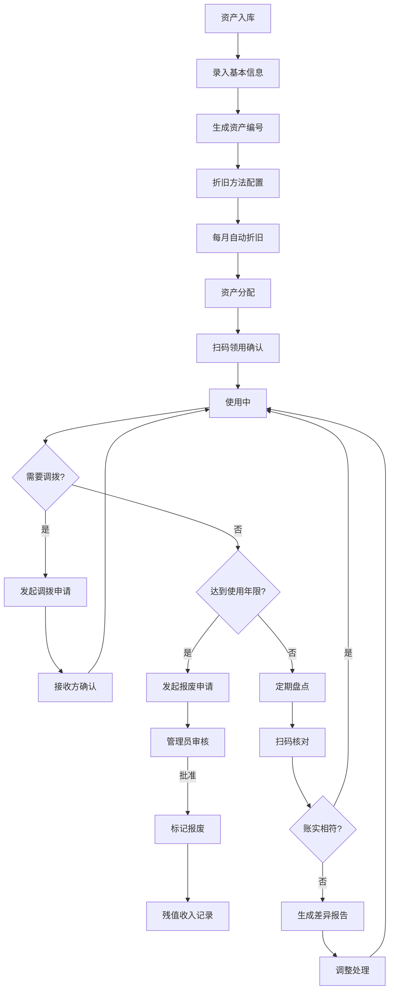
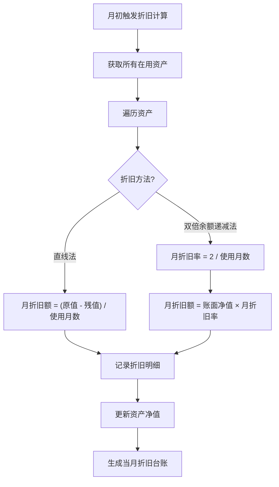

## 1. 产品概述

企业固定资产全生命周期管理系统，实现固定资产从入库、折旧、分配、调拨、报废到盘点的全流程数字化管理，提高资产管理效率，确保账实相符，辅助财务决算。

- 主要解决固定资产管理痛点：手工台账易出错、折旧计算繁琐、资产去向不明、盘点效率低下、财务对账困难
- 目标用户：企业财务部门、资产管理部门、各部门资产使用人员、系统管理员

## 2. 核心功能

### 2.1 用户角色

| 角色 | 注册方式 | 核心权限 |
|------|----------|----------|
| 系统管理员 | 系统预置 | 全功能权限、用户管理、参数配置、审核报废申请 |
| 财务人员 | 管理员创建 | 资产入库、折旧计算、台账查询、财务报表生成 |
| 资产管理员 | 管理员创建 | 资产分配、调拨管理、盘点管理 |
| 普通员工 | 管理员创建 | 资产领用确认、接收调拨、个人资产查询 |

### 2.2 功能模块

1. **资产入库模块**：资产信息录入、批量导入、资产档案管理
2. **折旧管理模块**：折旧方法配置、月折旧自动计算、净值变化台账
3. **资产分配模块**：部门/个人分配、扫码领用确认
4. **调拨管理模块**：调拨申请、接收确认、归属记录更新
5. **报废管理模块**：报废申请、管理员审核、残值收入记录
6. **盘点管理模块**：盘点计划创建、扫码盘点、差异报告生成
7. **财务报表模块**：资产台账、折旧明细表、差异分析报表

### 2.3 页面详情

| 页面名称 | 模块名称 | 功能描述 |
|---------|----------|----------|
| 首页仪表盘 | 数据概览 | 资产总数、总价值、本月折旧、在库/在用/报废统计、待办事项 |
| 资产列表 | 资产管理 | 资产列表展示、筛选、搜索、新增、编辑、删除、导出 |
| 资产详情 | 资产管理 | 资产完整信息展示、生命周期时间线、操作记录 |
| 折旧台账 | 折旧管理 | 折旧方法选择、月折旧计算、净值变化曲线、折旧明细 |
| 资产分配 | 分配管理 | 分配表单、部门/人员选择、二维码生成、扫码确认 |
| 调拨管理 | 调拨管理 | 调拨申请单、审批流程、接收确认、历史记录 |
| 报废管理 | 报废管理 | 报废申请、审核操作、残值记录、报废列表 |
| 盘点管理 | 盘点管理 | 盘点计划、扫码盘点、差异报告、盘点历史 |
| 财务报表 | 报表中心 | 资产负债表、折旧明细表、盘点差异表、分类汇总表 |
| 系统设置 | 系统管理 | 类别管理、部门管理、用户管理、参数配置 |

## 3. 核心流程

### 3.1 资产生命周期流程

### 3.2 折旧计算流程

## 4. 用户界面设计

### 4.1 设计风格

- **主色调**：深蓝色 (#1e3a8a) 代表专业、稳重、可信赖
- **辅助色**：绿色 (#15803d) 表示正常、确认；橙色 (#f97316) 表示警告、待办；红色 (#dc2626) 表示报废、异常
- **中性色**：白色背景，浅灰卡片，深灰文字
- **按钮风格**：圆角矩形按钮，扁平化设计，悬停微动画
- **字体**：思源黑体 - 标题700，正文400
- **布局风格**：左侧导航栏 + 顶部工具栏 + 内容卡片式布局
- **图标风格**：线性图标，统一24px尺寸

### 4.2 页面设计概览

| 页面名称 | 模块名称 | UI元素 |
|---------|----------|--------|
| 首页仪表盘 | 数据概览 | 统计卡片、折线图、饼图、待办列表、快捷操作区 |
| 资产列表 | 资产管理 | 搜索栏、筛选器、数据表格、分页、操作按钮 |
| 资产详情 | 资产管理 | 信息卡片、时间线、操作记录、操作按钮组 |
| 折旧台账 | 折旧管理 | 方法切换、数据表格、净值趋势图 |
| 盘点管理 | 盘点管理 | 扫码区域、盘点进度、差异列表 |

### 4.3 响应式

- 桌面端优先设计（1920px及以上
- 适配1200px以上自适应
- 平板端（768-1200px：导航可折叠
- 移动端（768px以下：简化布局，重点功能可用

### 4.4 交互体验

- 页面加载骨架屏
- 操作成功/失败Toast提示
- 表单输入即时校验
- 表格行悬停高亮
- 模态对话框操作确认
