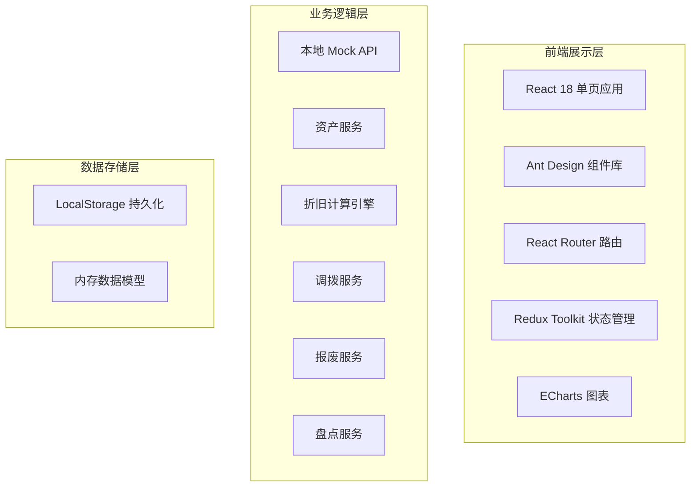

## 1. 架构设计



## 2. 技术描述

- **前端框架**：React@18.2.0 + TypeScript@5.3.0
- **构建工具**：Vite@5.0.0
- **UI 组件库**：Ant Design@5.12.0
- **状态管理**：Redux Toolkit@2.0.0
- **路由管理**：React Router@6.20.0
- **图表库**：ECharts@5.4.0
- **样式方案**：TailwindCSS@3.4.0
- **二维码生成**：qrcode.react@3.1.0
- **数据存储**：LocalStorage（Mock数据）

## 3. 路由定义

| 路由 | 页面 | 说明 |
|------|------|------|
| /dashboard | 首页仪表盘 | 数据概览、快捷操作 |
| /assets | 资产列表 | 资产列表展示、筛选、搜索 |
| /assets/new | 新增资产 | 资产信息录入表单 |
| /assets/:id | 资产详情 | 资产完整信息、时间线 |
| /depreciation | 折旧台账 | 折旧计算、净值变化 |
| /allocation | 资产分配 | 资产分配、领用确认 |
| /transfer | 调拨管理 | 调拨申请、接收确认 |
| /scrap | 报废管理 | 报废申请、审核、残值 |
| /inventory | 盘点管理 | 盘点计划、扫码盘点 |
| /reports | 财务报表 | 各类财务报表 |
| /settings | 系统设置 | 类别、部门、用户管理 |

## 4. 数据模型

### 4.1 实体关系图

```mermaid
erDiagram
    ASSET ||--o{ DEPRECIATION_RECORD : has
    ASSET ||--o{ ALLOCATION_RECORD : has
    ASSET ||--o{ TRANSFER_RECORD : has
    ASSET ||--o{ SCRAP_RECORD : has
    ASSET ||--o{ INVENTORY_DETAIL : has
    CATEGORY ||--o{ ASSET : contains
    DEPARTMENT ||--o{ USER : has
    USER ||--o{ ALLOCATION_RECORD : uses
    TRANSFER_RECORD ||--|| USER : from
    TRANSFER_RECORD ||--|| USER : to
    INVENTORY_PLAN ||--o{ INVENTORY_DETAIL : has
```

### 4.2 核心数据模型定义

```typescript
// 资产类别
interface Category {
  id: string;
  name: string;
  code: string;
  usefulLife: number; // 折旧年限（年）
  depreciationMethod: 'straight' | 'double-declining';
  residualRate: number; // 残值率
}

// 部门
interface Department {
  id: string;
  name: string;
  code: string;
  parentId?: string;
}

// 用户
interface User {
  id: string;
  username: string;
  name: string;
  role: 'admin' | 'finance' | 'asset-manager' | 'employee';
  departmentId: string;
}

// 固定资产
interface Asset {
  id: string;
  assetNo: string; // 资产编号
  name: string;
  categoryId: string;
  purchaseDate: string;
  originalValue: number; // 原值
  usefulLife: number; // 使用年限（月）
  depreciationMethod: 'straight' | 'double-declining';
  residualValue: number; // 残值
  currentValue: number; // 当前净值
  accumulatedDepreciation: number; // 累计折旧
  status: 'in-stock' | 'in-use' | 'transferred' | 'scrapped' | 'lost';
  location?: string;
  currentUserId?: string;
  currentDepartmentId?: string;
  qrCode?: string;
  createdAt: string;
  updatedAt: string;
}

// 折旧记录
interface DepreciationRecord {
  id: string;
  assetId: string;
  period: string; // 期间：YYYY-MM
  depreciationMethod: 'straight' | 'double-declining';
  monthlyDepreciation: number; // 本月折旧
  accumulatedDepreciation: number; // 累计折旧
  bookValue: number; // 账面净值
  createdAt: string;
}

// 分配记录
interface AllocationRecord {
  id: string;
  assetId: string;
  userId: string;
  departmentId: string;
  allocationDate: string;
  confirmedAt?: string;
  status: 'pending' | 'confirmed' | 'returned';
}

// 调拨记录
interface TransferRecord {
  id: string;
  assetId: string;
  fromUserId: string;
  toUserId: string;
  fromDepartmentId: string;
  toDepartmentId: string;
  applyDate: string;
  confirmedAt?: string;
  status: 'pending' | 'approved' | 'rejected' | 'confirmed';
  reason?: string;
}

// 报废记录
interface ScrapRecord {
  id: string;
  assetId: string;
  applyUserId: string;
  applyDate: string;
  reason: string;
  approvedAt?: string;
  approvedBy?: string;
  status: 'pending' | 'approved' | 'rejected';
  residualIncome?: number; // 残值收入
}

// 盘点计划
interface InventoryPlan {
  id: string;
  name: string;
  startDate: string;
  endDate: string;
  status: 'draft' | 'in-progress' | 'completed';
  createdBy: string;
}

// 盘点明细
interface InventoryDetail {
  id: string;
  planId: string;
  assetId: string;
  systemStatus: string;
  checkedAt?: string;
  checkResult: 'matched' | 'mismatched' | 'lost' | 'pending';
  remark?: string;
}
```

## 5. 核心算法

### 5.1 直线法折旧

```
月折旧率 = (1 - 残值率) / 使用年限 / 12
月折旧额 = 原值 × 月折旧率
```

### 5.2 双倍余额递减法

```
月折旧率 = 2 / 使用年限 / 12
月折旧额 = 账面净值 × 月折旧率
* 最后两年转为直线法
```

## 6. 目录结构

```
src/
├── assets/              # 静态资源
├── components/          # 公共组件
│   ├── Layout/
│   ├── AssetCard/
│   ├── QRCodeScanner/
│   └── Chart/
├── pages/               # 页面组件
│   ├── Dashboard/
│   ├── AssetList/
│   ├── AssetDetail/
│   ├── AssetForm/
│   ├── Depreciation/
│   ├── Allocation/
│   ├── Transfer/
│   ├── Scrap/
│   ├── Inventory/
│   ├── Reports/
│   └── Settings/
├── store/               # Redux状态
│   ├── slices/
│   └── index.ts
├── services/            # API服务
│   ├── mock/
│   ├── assetService.ts
│   ├── depreciationService.ts
│   └── ...
├── utils/               # 工具函数
│   ├── depreciation.ts  # 折旧计算引擎
│   ├── helpers.ts
│   └── constants.ts
├── types/               # TypeScript类型定义
├── App.tsx
└── main.tsx
```
